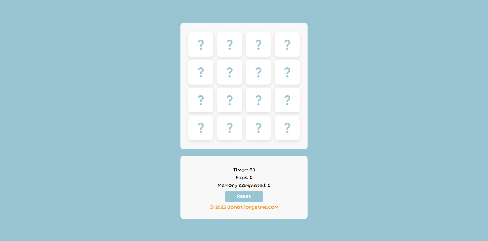
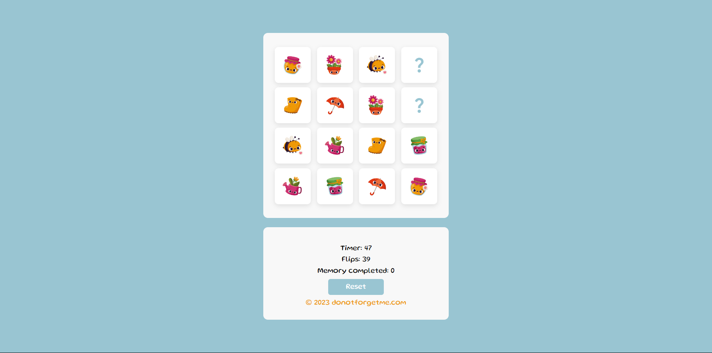
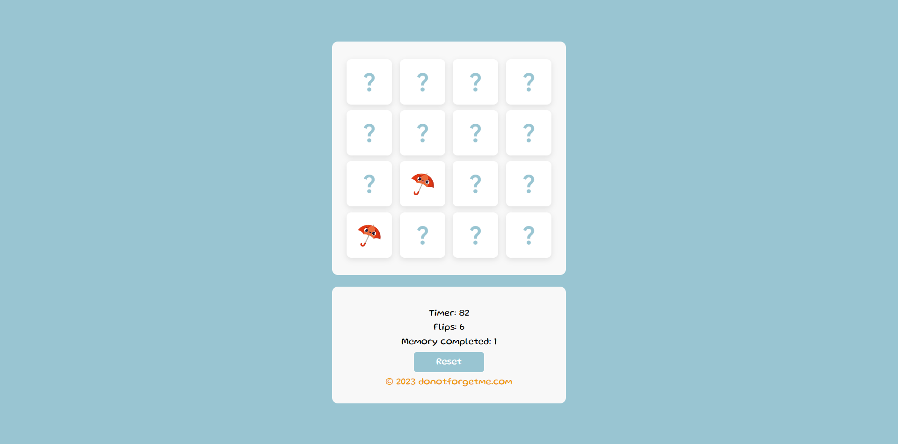

# DoNotForgetMe
## Description

The Memory game is a classic and fun board game that challenges your memory. The game consists of a set of rectangular cards arranged face down on a flat surface, such as a table. Each card has an identical pair that matches it.

The objective of the game is to find all the matching pairs of cards by flipping them over two at a time. At the beginning of the game, all the cards are shuffled and placed face down. The player can flip over any two cards of their choice. If the two flipped cards form a pair, the cards are disabled and stay visible for the player. If the two cards are not identical, the player flips them back face down. In both cases, the flip counter is incremented.

The game continues until all the pairs of cards have been found. Once all the pairs are found, the game reshuffles, and the player can play again. A counter keeps track of how many consecutive sets the player has completed. If the player doesn't find all the pairs within a time limit, they lose, their score is reset to 0, and previous completed sets are also reset.

Memory is an ideal game for developing concentration, visual memory, and the ability to memorize the positions of different cards. It can be played alone for practice or with multiple players to add a competitive aspect.

The font used is Gluten by Tyler Finck.

---

## Screenshots

